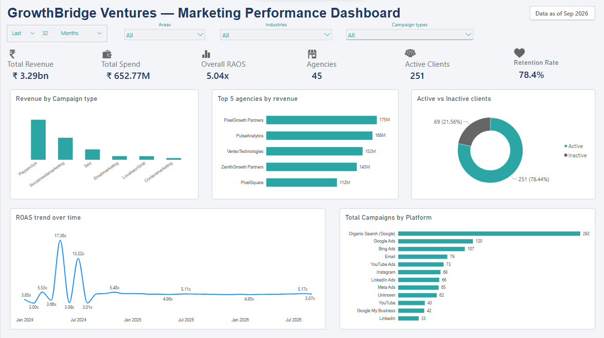

# 📊 GrowthBridge Ventures — Digital Marketing Agency Market Analysis

**A full-pipeline data analyst project** — from a pile of deliberately messy CSVs to a live Power BI dashboard, using Python, MySQL, and Power BI end to end.


---

## 🧩 The Brief

> You've just been hired as a Data Analyst by **GrowthBridge Ventures** — a Lucknow-based startup building a digital marketing agency marketplace. Think *"JustDial meets Clutch.co"*, but specifically for SMEs across **Lucknow, Rae Bareli, and Gomti Nagar** who want to hire a marketing agency and have no idea which one to trust.
>
> Before launch, the Head of Product partnered with a regional trade body to get anonymized performance data — **45 agencies, 320 client engagements, and 380K+ days of campaign performance** across the *whole* regional ecosystem, not just one agency's books.
>
> Her ask: *"Pull together every useful insight from these four CSVs so we know what problem we're actually solving — I need this in front of investors next week."*

No pre-written questions. No clean data. Just a business problem and four raw files. This project is the answer.

---

## 🗂️ What's Actually Broken In This Data (and why that's the point)

Real client data is never clean, so this dataset wasn't generated clean either. Before any analysis could happen, the raw files needed real forensic work:

| Problem found | Example |
|---|---|
| **13 spellings for 6 real categories** | `campaign_type` had `SEO`, `seo`, `S.E.O`, `Seo` all meaning the same thing |
| **5 different date formats in one column** | `2025-06-23`, `23/06/2025`, `23-Jun-2025`, `2025/06/23`, `23.06.2025` — all in `start_date` |
| **Currency stored as inconsistent text** | `₹15,000`, `Rs. 15000`, `15,000`, `15000.0` all meant the same retainer fee |
| **Recoverable "missing" data** | `objective` was blank in some rows — but the answer was hiding in `campaign_name` (`"PPC - Lead Generation"`) the whole time |
| **Broken join keys** | Whitespace and casing mismatches (`" CMP00013"` vs `"CMP00013"`) silently fragmented `GROUP BY` results until caught |

Every one of these was found by *actually inspecting the data*, not assumed — and each fix is documented with the reasoning behind it in the notebook, not just the code.

---

## 🏗️ Pipeline

```
raw_data/  →  Python (pandas)  →  cleaned/  →  MySQL (joins · CTEs · window functions)  →  Power BI  →  dashboard/
```

| Stage | Tool | What happened |
|---|---|---|
| **Clean** | Python (pandas, numpy) | Standardize text → fix dtypes → handle missing values → validate logic — in that order, because doing it out of order silently breaks later steps |
| **Analyze** | MySQL | Multi-table JOINs, `GROUP BY` aggregation, `CASE` bucketing, CTEs, and `RANK() OVER` window functions to answer specific business questions |
| **Visualize** | Power BI | A single, focused dashboard page — not three half-built ones |

**Why clean → type → missing (in that order)?** Standardizing text first means duplicate detection actually catches duplicates hidden behind casing differences (`"Lucknow"` vs `"lucknow "`). Converting types before deduping means missing-value imputation uses correct numeric/date values, not raw strings. Skip a step or reorder it, and the next one silently produces wrong numbers.

---

## 📈 The Dashboard



- **6 KPI cards** — Total Revenue, Total Spend, Overall ROAS, Agencies, Active Clients, Retention Rate
- **4 slicers** — Last refreshed Date, Area, Industry, Campaign Type
- **5 charts** — Revenue by Campaign Type, Top 5 Agencies by Revenue, Active vs Inactive Clients, ROAS Trend Over Time, Campaign Count by Platform

The `.pbix` file is in [`dashboard/`](dashboard/) if you want to open it and poke around the model yourself.

---

## 🔎 Key Findings

### The market, in five numbers
| Metric | Value |
|---|---|
| Total Revenue | ₹3.29 billion |
| Total Ad Spend | ₹652.77 million |
| Overall Market ROAS | **5.04x** |
| Active Agencies | 45 |
| Client Retention Rate | **78.4%** (251 of 320 clients) |

### 🏆 Bigger isn't better
Bucketing agencies by team size (Small `<30` / Mid `30–80` / Large `80+`) and comparing average ROAS shows **small agencies consistently outperform large ones**. Team size is not a reliable proxy for quality — which matters a lot for a marketplace deciding who to feature.

### ⭐ Star ratings lie
Google rating and actual campaign ROAS show **no meaningful correlation**. A 3.9-rated agency can easily out-earn a 4.9-rated one. If GrowthBridge wants a real trust signal, it has to be built on performance data — not reviews.

### 💰 PPC dominates revenue, but that's not the whole story
PPC alone drives roughly half of all revenue in the region, with Social Media Marketing a distant second. But agencies over-indexed on a single channel also show more volatile ROAS across campaign types — diversification looks like it buys consistency, not just top-line revenue.

### 📉 The early ROAS spikes are a lesson, not an anomaly
The ROAS trend chart shows wild swings early on (up to 17x!) that settle into a steady ~5x band over time. That's not noisy data — it's a **small-sample-size artifact**: early months have few campaigns reporting, so a single high-performer swings the average wildly. A good reminder to always check volume before trusting a trend line's first few points.

---

## 🛢️ Sample SQL

A taste of the analysis layer — full query set lives alongside the notebook.

```sql
-- Rank every agency by total revenue generated for its clients (window function)
SELECT
    a.agency_id,
    a.agency_name,
    ROUND(SUM(cp.revenue_inr), 2) AS total_revenue,
    RANK() OVER (ORDER BY SUM(cp.revenue_inr) DESC) AS revenue_rank
FROM agencies a
JOIN clients c              ON c.agency_id = a.agency_id
JOIN campaigns ct            ON ct.client_id = c.client_id
JOIN campaign_performance cp ON cp.campaign_id = ct.campaign_id
GROUP BY a.agency_id, a.agency_name
ORDER BY revenue_rank;
```

```sql
-- Clients running 3+ campaigns, using a CTE to build the aggregate first
WITH campaign_counts AS (
    SELECT client_id, COUNT(*) AS total_campaigns
    FROM campaigns
    GROUP BY client_id
)
SELECT c.client_id, c.business_name, c.industry, cc.total_campaigns
FROM campaign_counts cc
JOIN clients c ON c.client_id = cc.client_id
WHERE cc.total_campaigns >= 3
ORDER BY cc.total_campaigns DESC;
```

---

## 📁 Repo Structure

```
├── raw_data/                        # Original, untouched, deliberately messy CSVs
├── cleaned/                         # Output of the cleaning notebook
├── scripts/                         # Supporting Python scripts
├── kpi_icons/                       # Icon assets used in the Power BI dashboard
├── dashboard/
│   ├── bi_digital_marketing.pbix    # The Power BI file
│   └── seo_dashboard.png            # Dashboard screenshot
├── py_seo_performance_analytics.ipynb   # Full cleaning + validation notebook
└── GrowthBridge_Ventures_report.pdf     # Written project report
```

---

## 🧠 What This Project Actually Demonstrates

It's easy to run `.dropna()` and call data "clean." The harder (and more useful) skill is knowing **why** a value is missing before deciding what to do about it:

- Recovering `objective` from `campaign_name` instead of blindly imputing it
- Recalculating `roas` from clean `revenue`/`spend` instead of statistically guessing at a derived field
- Catching that a `GROUP BY` was silently fragmenting because of whitespace in a join key — *before* trusting the aggregated numbers
- Choosing to defer orphan foreign-key cleanup to the SQL layer deliberately, not by accident

That judgment — not the `pandas` syntax — is the actual point of this project.

---

## 🚀 Reproduce It Yourself

1. Clone the repo
2. Run `py_seo_performance_analytics.ipynb` top to bottom — cleans `raw_data/` and writes to `cleaned/`
3. Load the cleaned CSVs into MySQL (schema + load steps are in the notebook)
4. Open `dashboard/bi_digital_marketing.pbix` in Power BI Desktop and point it at your local MySQL instance

---

## 🔭 Possible Next Steps

- Tidy up campaign-type labels on the dashboard (`Payperclick`, `Localseogmb`) into cleaner display names (`PPC`, `Local SEO/GMB`) via a display-name mapping table
- Repair or clearly report on the orphan foreign-key records instead of leaving them for a future pass
- Add a churn cohort analysis — is there a "danger window" after onboarding where most clients leave?
- Extend to a second dashboard page for agency-level and campaign-level deep dives

---

## 🛠️ Tech Stack

**Python** (pandas, numpy) · **MySQL** · **Power BI** · **Jupyter Notebook**

---

*Dataset is synthetic, generated for this portfolio project. Absolute figures are illustrative — the cleaning methodology, SQL logic, and analytical reasoning are what transfer to real-world data.*

**Author:** Tabish Afzal
